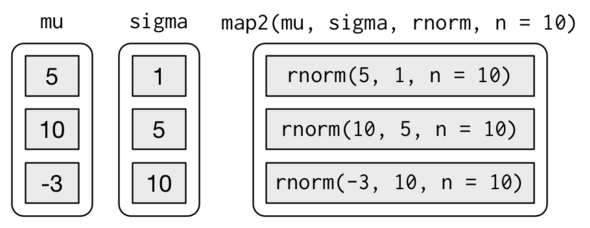

# Vectorization, *apply and for loops

This section will cover the basics of vectorizations, the `*apply` family of functions and `for` loops.


## Vectorization

Almost everything in `R` is a vector. A scalar is really a vector of length 1 and a `data.frame` is a collection of vectors. An nice feature of \texttt{R} is its vectorized capabilities. Vectorization indicates that a function operates on a whole vector of values at the same time and not just on a single value^[[http://www.dummies.com/how-to/content/how-to-vectorize-your-functions-in-r.html](http://www.dummies.com/how-to/content/how-to-vectorize-your-functions-in-r.html)]. If you have have ever taken a basic linear algebra course, this concept will be familiar to you.
\newline 
\vspace{0.1in}
\pause Take for example two vectors: 
\newline
\vspace{0.1in}
$$
\begin{bmatrix} 1 \\ 2 \\ 3 \end{bmatrix} + 
\begin{bmatrix} 1 \\ 2 \\ 3 \end{bmatrix} =
\begin{bmatrix} 2 \\ 4 \\ 6 \end{bmatrix}
$$
\newline 
\vspace{0.1in}
The corresponding `R` code is given by:
```{r}
a <- c(1,2,3)
b <- c(1,2,3)
a+b
```

Many of the `base` functions in `R` are already vectorized. Here are some common examples:

```{r}

# generate a sequence of numbers from 1 to 10
(a <- 1:10)

# sum the numbers from 1 to 10
sum(a)

# calculate sums of each column
colSums(iris[, -5])

```


> **Exercise**: What happens when you sum two vectors of different lengths?

## Family of `*apply` functions

- `apply`, `lapply` and `sapply` are some of the most commonly used class of functions in `R`
- `*apply` functions are not necessarily faster than loops, but can be easier to read (and vice cersa)
- `apply` is used when you need to perform an operation on every row or column of a matrix or data.frame
- `lapply` and `sapply` differ in the format of the output. The former returns a list while the ladder returns a vector
- There are other `*apply` functions such as `tapply`, `vapply` and `mapply` with similar functionality and purpose


### Loops vs. Apply

```{r}

# Getting the row means of two columns
# Generate data
N <- 10000
x1 <- runif(N)
x2 <- runif(N)
d <- as.data.frame(cbind(x1, x2))
head(d)

# Loop:
# create a vector to store the results in 
rowMeanFor <- vector("double", N)

for (i in seq_len(N)) {
        rowMeanFor[[i]] <- mean(c(d[i, 1], d[i, 2]))
}

# Apply:
rowMeanApply <- apply(d, 1, mean)

# are the results equal
all.equal(rowMeanFor,rowMeanApply)

```


### Descriptive Statistics using `*apply`

```{r}
data(women)
# data structure
str(women)

# calculate the mean for each column
apply(women, 2, mean)

# apply 'fivenum' function to each column
vapply(women, fivenum, c("Min." = 0, "1st Qu." = 0, "Median" = 0, 
                         "3rd Qu." = 0, "Max." = 0))
```


### Creating new columns using `sapply`

You can apply a _user defined function_ to columns or the entire data frame:

```{r}
# the ouput of sapply is a vector
# the 's' in sapply stands for 'simplified' apply
mtcars$gear2 <- sapply(mtcars$gear, 
                       function(i) if (i==4) "alot" else "some")

head(mtcars)[,c("gear","gear2")]
```


### Applying functions to subsets using `tapply`

```{r}

# Fisher's famous dataset 
data(iris)
str(iris)

# mean sepal length by species 
tapply(iris$Sepal.Length, iris$Species, mean)
```


### Nested for loops using `mapply`

`mapply` is my favorite `base` `R` function and here are some reasons why:

- Using `mapply` is equivalent to writing nested `for` loops except that it is 100% more human readable and less prone to errors
- It is an effective way of conducting simulations because it iterates of many arguments

Let's say you want to generate random samples from a normal distribution with varying means and standard deviations. Of course the brute force way would be to write out the command once, copy paste as many times as you want, and then manually change the arguments for `mean` and `sd` in the `rnorm` function as so:

```{r}
v1 <- rnorm(100, mean = 5, sd = 1)
v2 <- rnorm(100, mean = 10, sd = 5)
v3 <- rnorm(100, mean = -3, sd = 10)
```

This isn't too bad for three vectors. But what if you want to generate many more combinations of means and sds ? Furthermore, how can you keep track of the parameters you used? Now lets consider the `mapply` function:

```{r}
means <- c(5,10,-3) ; sds <- c(1,5,10) 

# MoreArgs is a list of arguments that dont change
randomNormals <- mapply(rnorm, mean = means, sd = sds, 
                        MoreArgs = list(n = 100))

head(randomNormals)
```

The following diagram (from [r4ds](http://r4ds.had.co.nz/iteration.html#mapping-over-multiple-arguments)) describes exactly what is going on in the above function call to `mapply`:

```{r, echo=FALSE}

```

Advantages:

1. Result is automatically stored in a matrix
2. The parameters are also saved in `R` objects so that they can be easily manipulated and/or recovered


Consider a more complex scenario where you want to consider many possible combinations of means and sds. We take advantage of the `expand.grid` function to create a `data.frame` of simulation parameters:

```{r}
simParams <- expand.grid(means = 1:10,
                         sds = 1:10)

randomNormals <- mapply(rnorm, mean = simParams$means, 
                        sd = simParams$sds, 
                        MoreArgs = list(n = 100))

dim(randomNormals)

```


## Creating dynamic documents with `mapply`

Save the following code in a file called `template.Rnw`

```{r}
mtcars
```


