# Simulations

In this chapter you'll learn how to conduct a simulation study. The word _simulation_ gets thrown around alot as a trivial concept, though I have found that this term is often either misused by epidemiologists or abused by statisticians. A source of this confusion arises from the fact that it is not well defined. This is not by accident. A simulation study has so many moving parts that it would be impossible to characterize in a single word. However, there are some common underlying themes behind simulation studies. For this reason, the main focus here will be on creating a general roadmap for conducting these types of analyses, that can be applied to your specific setting. 


## What is a simulation study?

Here are some results from a Google Search:

1. A numerical technique for conducting experiments on the computer [@marie]
2. Simulations provide a powerful technique for answering a broad set of methodological and theoretical questions and provide a flexible framework to answer specific questions relevant to one's own research[@hallgren2013conducting]

I prefer the second definition because it speaks to the generality of simulations. Figure \@ref(fig:sim1) describes the way I see simulations.

```{r sim1, echo = FALSE, out.width = '80%', fig.cap="Simulation study general concept"} 

```

```{r sim1mod, echo=FALSE, fig.cap='Simulation study: general concept'}
DiagrammeR::mermaid("
graph LR
A(Rounded)-->B[Rectangular]
B-->C{A Rhombus}
C-->D[Rectangle One]
C-->E[Rectangle Two]
", height = 200)
```

Fig \@ref(sim1mod)
