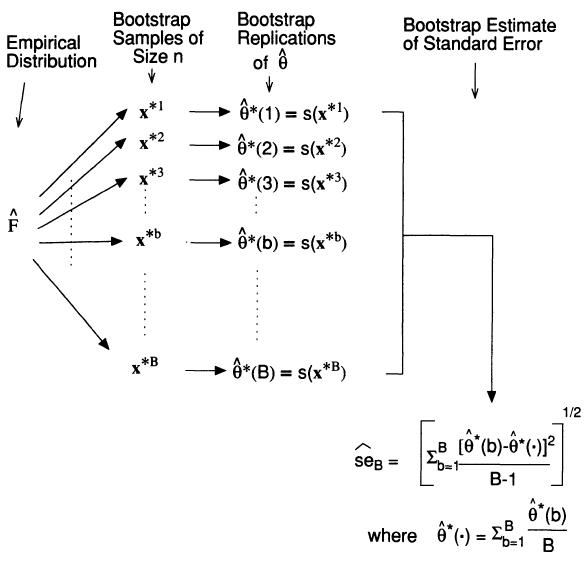

# Simulations

In this chapter you'll learn how to conduct a simulation study. The word _simulation_ gets thrown around alot as a trivial concept, though I have found that this term is often either misused by epidemiologists or abused by statisticians. A source of this confusion arises from the fact that it is not well defined. This is not by accident. A simulation study has so many moving parts that it would be impossible to characterize in a single word. However, there are some common underlying themes behind simulation studies. For this reason, the main focus here will be on creating a general roadmap for conducting these types of analyses, that can be applied to your specific setting. 


## What is a simulation study?

Here are some results from a Google Search:

1. A numerical technique for conducting experiments on the computer [@marie]
2. Simulations provide a powerful technique for answering a broad set of methodological and theoretical questions and provide a flexible framework to answer specific questions relevant to one's own research[@hallgren2013conducting]

I prefer the second definition because it speaks to the generality of simulations. I see simulations in the following way^[All flowcharts are created using the `DiagrammeR` pacakge [@R-DiagrammeR]]:

```{r, echo=FALSE}
DiagrammeR::mermaid("
graph LR
A((Input))-->B{Procedure}
B-->C[Output]
", height = 200)
```

There are three crucial components to any simulation study: 

1. **Procedure** - something that doesn't change throughout the simulation study
2. **Input**: _several_ values of the same quantity that are passed to the procedure. 
3. **Output**: result from the procedure being applied to the inputs. Should be equal in length to the number of outputs. The following toy example illustrates this point:

```{r, echo=-1}
set.seed(123)
f_sample_median <- function(true_mean) {
  x <- rnorm(20, mean = true_mean, sd = 1)
  median(x)
}

(means <- c(1,2,3))

(sample_medians <- sapply(means, f_sample_median))
```

So here, `f_sample_median` is the procedure that generates 20 random numbers from a normal distribution with standard deviation 1 and a user specified mean, and outputs the sample median. `means` is the input vector of user specified means, and `sample_medians` is the output:

```{r, echo=FALSE}
DiagrammeR::mermaid("
graph LR
A((1))-->B{f_sample_median}
D((2))-->B
E((3))-->B
B-->C[1.12]
B-->F[1.86]
B-->G[2.96]
", height = 300)
```


Using this very general definition of the word _simulation_, I see the following analysis techinques as a type of simulation. 

```{r, echo=FALSE}
DiagrammeR::mermaid("
graph TB
sq[Simulation] --> ci[Bootstrap]
sq --> A[Cross Validation]
sq --> B[Sensitivity Analysis]
sq --> C[Permutations]
classDef green fill:#9f6,stroke:#333,stroke-width:2px;
classDef orange fill:#f96,stroke:#333,stroke-width:4px;
class sq green
", height = 200)
```

Boostrap, Cross Validation, Sensitivity analysis and Permutations are all similar in that they have multiple inputs with an equal number of outputs, with a fixed procedure. What differentiates them is the context in which they can be applied. The technique you choose depends entirely on the question you're trying to answer. 

## Why conduct a simulation study?

The most common applications of simulation studies are the following

### Understanding the behaviour of a statistical quantity


#### Example 1: The Central Limit Theorem

The [Central Limit Theorem](https://en.wikipedia.org/wiki/Central_limit_theorem) is one of the most famous theorems in statistics. This theorem basically states that the sum or mean of independent random variables (with finite mean and variance) will converge to a normal distribution, regardless of the distribution of the random variables. The following figure clearly illustrates this point [@joseph]

```{r, echo=FALSE}
knitr::include_graphics("images/clt.png")
```

In this example, the statistical quantity of interest is the sum of the random variables. We want to verify that the sum of the time it takes to get to Purvis hall follows a normal distribution as the number of observations approaches infinity. Of course the CLT can be proven mathematically, but we can also simulate random numbers from different distributions in `R` to numerically verify this result. The simulation framework can be seen as follows:

```{r, echo=FALSE}
DiagrammeR::mermaid("
graph LR
A((Sample size n = 20))-->B{Generate n random numbers from<br>different distributions}
D((Sample size n = 100))-->B
E((Sample size n = 1000))-->B
B-->C[Mean and variance of<br>sum based on n = 20]
B-->F[Mean and variance of<br>sum based on n = 100]
B-->G[Mean and variance of<br>sum based on n = 1000]
")
```

Here we show a single run of the simulation with $n = 10,000$

```{r}
# number of observations to generate from each distribution
n <- 1e4

# true parameters of each distribution
mean.walk <- 4 ; var.walk <- 1
mean.bus <- (4+16)/2 ; var.bus <- (16-4)^2/12
mean.ride <- 8 ; var.ride <- 8 
mean.climb <- 6*0.5 ; var.climb <- 6*0.5^2
mean.fall <- 1/4 ; var.fall <- 1/4^2

# generate random samples from each distribution
walk <- rnorm(n, mean.walk, var.walk)
bus <- runif(n, 4, 16)
ride <- rpois(n, mean.ride)
climb <- rgamma(n, shape = 6, scale = 0.5)
fall <- rexp(n, rate = 1/mean.fall)

# true mean and variance of sum
mean.sum <- mean.walk+mean.bus+mean.ride+mean.climb+mean.fall
var.sum <- var.walk+var.bus+var.ride+var.climb+var.fall

# create a data frame of the data and calculate the sum for each sample
DT <- data.frame(walk, bus, ride, climb, fall)
DT$sum <- apply(DT,1,sum)

# plot each histogram and superimpose theoretical 
# distribution to empirical one
par(mfrow=c(2,3))
hist(walk, main="Normal(mean=4,sd=1)", freq=FALSE)
hist(bus, main="Uniform(a=4,b=16)", freq=FALSE)
hist(ride, main="Poisson(lambda=8)", freq=FALSE)
hist(climb, main="Gamma(shape=6, scale=0.5)", freq=FALSE)
hist(fall, main="Exponential(rate=4)", freq=FALSE)
hist(DT$sum, xlab='Total time', main=paste("Distribution of Sum, n = ",n), freq=FALSE)
curve(dnorm(x,mean=mean.sum,sd=sqrt(var.sum)),0,50,add=TRUE,lwd=2,col="red")
```

#### Example 2: Power Calculation

```{r, echo=FALSE, results='hide', message=FALSE, warning=FALSE}
library(pwr)
library(dplyr)
library(tidyr)
library(ggplot2)
```


```{r data, echo=FALSE}
ptab <- cbind(NULL, NULL)       # initalize ptab

for (i in seq(0,1, length.out = 200)){
  pwrt1 <- pwr.t2n.test(n1 = 28, n2 = 1406, sig.level = 0.05, power = NULL, d = i, alternative="two.sided")
  pwrt2 <- pwr.t2n.test(n1 = 144, n2 = 1290, sig.level = 0.05, power = NULL, d = i, alternative="two.sided")
  pwrt3 <- pwr.t2n.test(n1 = 287, n2 = 1147, sig.level = 0.05, power = NULL, d = i, alternative="two.sided")
  pwrt4 <- pwr.t2n.test(n1 = 430, n2 = 1004, sig.level = 0.05, power = NULL, d = i, alternative="two.sided")
  pwrt5 <- pwr.t2n.test(n1 = 574, n2 = 860, sig.level = 0.05, power = NULL, d = i, alternative="two.sided")
  pwrt6 <- pwr.t2n.test(n1 = 717, n2 = 717, sig.level = 0.05, power = NULL, d = i, alternative="two.sided")
  ptab <- rbind(ptab, cbind(pwrt1$d, pwrt1$power,
                            pwrt2$d, pwrt2$power,
                            pwrt3$d, pwrt3$power,
                            pwrt4$d, pwrt4$power,
                            pwrt5$d, pwrt5$power,
                            pwrt6$d, pwrt6$power))
}

ptab <- cbind(seq_len(nrow(ptab)), ptab)

colnames(ptab) <- c("id","n1=28, n2=1406.effect size","n1=28, n2=1406.power",
                    "n1=144, n2=1290.effect size","n1=144, n2=1290.power",
                    "n1=287, n2=1147.effect size","n1=287, n2=1147.power",
                    "n1=430, n2=1004.effect size","n1=430, n2=1004.power",
                    "n1=574, n2=860.effect size","n1=574, n2=860.power",
                    "n1=717, n2=717.effect size","n1=717, n2=717.power")


temp <- ptab %>%
  as.data.frame() %>%
  gather(key = name, value = val, 2:13) %>%
  separate(col = name, into = c("group", "var"), sep = "\\.") %>%
  spread(key = var, value = val)


temp$group <- factor(temp$group, levels = c("n1=28, n2=1406", "n1=144, n2=1290", "n1=287, n2=1147", "n1=430, n2=1004",
                                       "n1=574, n2=860", "n1=717, n2=717"))
```


When performing [Student's t-test](https://en.wikipedia.org/wiki/Student%27s_t-test) to compare difference in means between two groups, it is a useful exercise to determine the effect of unequal sample sizes in the comparison group on **power**. Large imbalances generally will not have adequate statistical power to detect even large effect sizes associated with a factor, leading to a high Type II error rate. To jusity this reasoning I performed a power analysis for different group sizes. A power curve typically has power (the probability of rejecting the null hypothesis when the alternative hypothesis is true) on the y-axis, and a measure of association (or effect size) on the x-axis. For a given sample size of both groups, we can calculate a power curve by varying the true effect size. The simulation framework can be seen as follows:

```{r, echo=FALSE}
DiagrammeR::mermaid("
graph LR
A((Effect Size 0.1))-->B{Procedure to calculate<br>power for t-test}
D((Effect Size 0.5))-->B
E((Effect Size 1))-->B
B-->C[Power for effect size of 0.1]
B-->F[Power for effect size of 0.5]
B-->G[Power for effect size of 1]
")
```

I considered the following group sizes:

1. n1 = 28, n2 = 1406: n1 represents 2% of the entire sample size of 1434
2. n1 = 144, n2 = 1290: n1 represents 10% of the entire sample size of 1434
3. n1 = 287, n2 = 1147: n1 represents 20% of the entire sample size of 1434
4. n1 = 430, n2 = 1004: n1 represents 30% of the entire sample size of 1434
5. n1 = 574, n2 = 860: n1 represents 40% of the entire sample size of 1434
6. n1 = 717, n2 = 717: equal size groups (this is optimal because it leads to the highest power for a given effect size)

In the figure below we plot the power curves for the $t$-test, as a function of the effect size, assuming a Type I error rate of 5%.

```{r echo=FALSE, opts.label='fig.full'}
p <- ggplot(temp, aes(x = `effect size`, y = power, color = group))
p + geom_line(size=2) + theme_bw() + theme(legend.position = "bottom",
                                           axis.text=element_text(size=14),
                                           axis.title=element_text(size=14),
                                           legend.text=element_text(size=14)) 
```

Here is the code used to produce the above plot

```{r, eval=FALSE, tidy=FALSE}
library(pwr) # for power calcs
library(dplyr) # for data manipulation
library(tidyr) # for data manipulation
library(ggplot2) # for plotting power curves

# Generate power calculations
ptab <- cbind(NULL, NULL)       

for (i in seq(0,1, length.out = 200)){
  pwrt1 <- pwr.t2n.test(n1 = 28, n2 = 1406, 
                        sig.level = 0.05, power = NULL, 
                        d = i, alternative="two.sided")
  pwrt2 <- pwr.t2n.test(n1 = 144, n2 = 1290, 
                        sig.level = 0.05, power = NULL, 
                        d = i, alternative="two.sided")
  pwrt3 <- pwr.t2n.test(n1 = 287, n2 = 1147, 
                        sig.level = 0.05, power = NULL, 
                        d = i, alternative="two.sided")
  pwrt4 <- pwr.t2n.test(n1 = 430, n2 = 1004, 
                        sig.level = 0.05, power = NULL, 
                        d = i, alternative="two.sided")
  pwrt5 <- pwr.t2n.test(n1 = 574, n2 = 860, 
                        sig.level = 0.05, power = NULL, 
                        d = i, alternative="two.sided")
  pwrt6 <- pwr.t2n.test(n1 = 717, n2 = 717, 
                        sig.level = 0.05, power = NULL, 
                        d = i, alternative="two.sided")
  ptab <- rbind(ptab, cbind(pwrt1$d, pwrt1$power,
                            pwrt2$d, pwrt2$power,
                            pwrt3$d, pwrt3$power,
                            pwrt4$d, pwrt4$power,
                            pwrt5$d, pwrt5$power,
                            pwrt6$d, pwrt6$power))
}

ptab <- cbind(seq_len(nrow(ptab)), ptab)

colnames(ptab) <- c("id","n1=28, n2=1406.effect size","n1=28, n2=1406.power",
                    "n1=144, n2=1290.effect size","n1=144, n2=1290.power",
                    "n1=287, n2=1147.effect size","n1=287, n2=1147.power",
                    "n1=430, n2=1004.effect size","n1=430, n2=1004.power",
                    "n1=574, n2=860.effect size","n1=574, n2=860.power",
                    "n1=717, n2=717.effect size","n1=717, n2=717.power")

# get data into right format for ggplot2
temp <- ptab %>%
  as.data.frame() %>%
  gather(key = name, value = val, 2:13) %>%
  separate(col = name, into = c("group", "var"), sep = "\\.") %>%
  spread(key = var, value = val)

# factor group
temp$group <- factor(temp$group, 
                levels = c("n1=28, n2=1406", "n1=144, n2=1290", 
                "n1=287, n2=1147", "n1=430, n2=1004",
                "n1=574, n2=860", "n1=717, n2=717"))


# plot
p <- ggplot(temp, aes(x = `effect size`, y = power, color = group))
p + 
geom_line(size=2) + 
theme_bw() + 
theme(legend.position = "bottom", 
      axis.text=element_text(size=14), 
      axis.title=element_text(size=14), 
      legend.text=element_text(size=14))
```


### Model selection and assessment

Model selection refers to

> Estimating the performance of different models in order to choose the best one [@esl]

Model assessment refers to

> Estimating the prediction error on new data, given that a model has been selected  

In real data analysis problems we often have many models to choose from, for example, different combinations of covariates result in different models. The question is how can we can select the model that best fits the data and generalizes to other datasets? Information criteria such as the AIC, BIC and QIC can be used in different settings, however there are some known pitfalls to these (see for example @wang2015perils). 

Here is an example of model selection in the penalized regression setting. We consider a regression model for an outcome variable $Y=(y_1, \ldots, y_n)$ which follows an exponential family. Let $\boldsymbol{X} = (X_{1}, \ldots, X_{p})$ be a matrix of covariates, where $p >> n$. Consider the regression model with main effects:
\begin{align}
g(\boldsymbol{\mu})  = & \beta_0  + \beta_1 X_{1} + \cdots + \beta_p X_p  \label{eq:linpred1}
\end{align}
where $g(\cdot)$ is a known link function and $\boldsymbol{\mu} = \mathsf{E}\left[Y|\boldsymbol{X}, \boldsymbol{\beta} \right]$. Our goal is to estimate the parameters $\boldsymbol{\beta} = \left(\beta_1, \beta_2, \ldots, \beta_p\right) \in \mathbb{R}^{p+1}$. Due to the large number of parameters to estimate with respect to the number of observations, one commonly-used approach is to shrink the regression coefficients by placing a constraint on the values of $\boldsymbol{\beta}$. For example, the LASSO [@tibshirani1996regression] penalizes the squared loss of the data with the \mbox{$L_1$-norm} of the regression coefficients resulting in a method that performs both model selection and estimation:
\begin{equation}
argmin_{\beta_0, \boldsymbol{\beta} } \,\,\, \frac{1}{2} \left\Vert Y - g(\boldsymbol{\mu}) \right\Vert ^2 + \lambda  \left\Vert \boldsymbol{\beta} \right\Vert_1  \label{eq:lassolikelihood}
\end{equation}
where $\left\Vert Y - g(\boldsymbol{\mu})\right\Vert^2 = \sum_i (y_i - g(\mu_i))^2$, $\left\Vert \boldsymbol{\beta}\right\Vert_1 = \sum_j | \beta_j  |$ and $\lambda \geq 0$ is a data driven tuning parameter that can set some of the coefficients to zero when sufficiently large. 

It should be noted here that different tuning parameters will lead to different models. So the question here is how to choose the optimal $\lambda$. A very common techinque is to use cross-validation [@esl]: 

```{r, echo=FALSE}
knitr::include_graphics("images/cv.png")
```

The data is split into $K = 5$ (or 10) roughly equal sized parts. The model is fit on all the data except the Kth part, and the prediction error of the fitted model is calculated on the Kth part. This is repeated K times, and the error from each fold is averaged. The simulation framework can be seen as follows:

```{r, echo=FALSE}
DiagrammeR::mermaid("
graph LR
A((Fold 1))-->B{Fit LASSO Model<br>on remaining folds}
D((Fold 2))-->B
E((Fold 3))-->B
F((Fold 4))-->B
G((Fold 5))-->B
B-->C[Prediction error<br>on left-out fold]
B-->H[Prediction error<br>on left-out fold]
B-->I[Prediction error<br>on left-out fold]
B-->J[Prediction error<br>on left-out fold]
B-->K[Prediction error<br>on left-out fold]
")
```

Note this is for a single tuning parameter. We would repeat the above steps for a range of tuning parameters. This technique for choosing the tuning parameter in Equation \@ref(eq:lassolikelihood) is implemented in the `glmnet` package [@R-glmnet]:


```{r, message=FALSE}
library(glmnet)
set.seed(12345)

# number of subjects
n <- 100

# number of covariates
p <- 1000

# number of true non-zero coefficients
nzc <- 25

# covariates
x <- matrix(rnorm(n*p),n,p)

# true beta coefficients
beta <- rnorm(nzc)

# generate response. only the first nzc are associated with y
y <- x[,seq(nzc)] %*% beta + rnorm(n)*5

# perform cross-validation
cvobj <- cv.glmnet(x,y)

# plot cross validation curve
plot(cvobj)

# final selected model based on CV-selected lambda
coefobj <- coef(cvobj, s = "lambda.min")

# non-zero elements of selected model and their effect estimate
coefobj[glmnet:::nonzeroCoef(coefobj),,drop = F]

```

While we have shown an example of model selection, cross validation can also be used to assess the chosen model but this should be done on an **independent** data set, i.e., one that was not used to train and select the model.


### Calculating measures of uncertainty 

The Bootstrap [@efron1994introduction] is a widely used procedure to calculate measures of uncertainty (e.g. confidence intervals, standard errors of paramters). Its popularity is due to its relative simplicity. Furthermore, the data analyst often has no choice but to bootstrap because no closed form mathematical solution exists. The main idea is summarised in the following diagram:

```{r, echo=FALSE}

```


#### Example 1: Non-parametric Bootstrap for Confidence Intervals of the mean^[This example has been reproduced with permission from Dr. David A. Stephens [@david]]

The following data are the survival times for mice in a randomized experiment comparing a treated group with a control group.

```{r}
# control group
(mouse.c <- scan("http://www.rohan.sdsu.edu/~babailey/stat672/mouse.c.data"))

# treatment group
(mouse.t <- scan("http://www.rohan.sdsu.edu/~babailey/stat672/mouse.t.data"))
```

We are interested in bootstrap confidence intervals for the mean survival time in the control group:

```{r}
# number of mice in control group
n.c <- length(mouse.c)

# point estimates of mean and standard error of survival time
mean(mouse.c)

# recall that standard error of the mean is sigma/sqrt{n}
# if the presumption of normality is made than this is the 
# plug-in estimate of the standard error
sd(mouse.c)*sqrt((n.c-1)/n.c^2)
```


We take advantage of thee very flexible `boot` package [@R-boot]:

```{r, tidy=FALSE}
library(boot)

# define a function where the first argument is the data
# and the second argument will take a vector of indices used to subset the data
meancalc <- function(x,i) {
  
    # always subset the data first
     d <- x[i]
     m <- mean(d)
     n <- length(i)
     v <- (n-1)*var(d)/n^2
     
     # bootstrap variances needed for studentized intervals
     return(c(m, v))
}

# run the boot function for B=10,000 bootstrap samples
# the bootstrap statistics returns the bias for the sample mean (t1)
# and sample variance 
(bmean <- boot(mouse.c, meancalc, R = 1e4))

# calculate different types of confidence intervals
mouse.ci <- boot.ci(bmean)

# histogram of bootstrap replicates and confidence intervals
hist(bmean$t[,1], xlab = expression(theta), col='gray', xlim = c(0,150),
     main = expression(paste('Bootstrap resamples of ', hat(theta))));box()


abline(v = mean(mouse.c), col='red', lwd=2)
abline(v=mouse.ci$normal[2:3],col='green')
abline(v=mouse.ci$basic[4:5],col='blue')
abline(v=mouse.ci$student[4:5],col='green',lty=2)
abline(v=mouse.ci$percent[4:5],col='blue',lty=2)
abline(v=mouse.ci$bca[4:5],col='orange')

legend("topright",c('Est.','Normal','Basic','Student','Percent','BCa'),
col=c('red','green','blue','green','blue','orange'),lty=c(1,1,1,2,2,1))
```


#### Example 2: Non-parametric Bootstrap for Causal Effect Estimates in Marginal Structural Models

_Labour Training Evaluation Data_: This data frame from the `DAAG` package [@R-DAAG] contains 445 rows and 10 columns. These data are from an investigation of the effect of training on changes, between 1974-1975 and 1978, in the earnings of individuals who had experienced employment difficulties. Data are for the male experimental control and treatment groups. The goal of this study was to determine if a job training intervention led to increased earnings. The training program was created to encourage people to get to work and to take better jobs. Here are the data:

```{r, echo=FALSE}
DT::datatable(DAAG::nsw74demo)
```

We are interested in evaluating the effect of a binary treatment, participation in the training program or not, on the continuous outcome of real income in 1978. In this study, treatment is not randomized, therefore direct comparison of the 1978 earnings between treated and untreated will lead to a biased estimate of the effect of the training program. The covariates were not balanced between groups. 

The propensity score (PS) for an individual, defined as the conditional probability of being treated given the individual's covariates, can be used to balance the covariates in the two groups, and thus reduce this bias. Once estimated, the propensity score can be used to reduce bias through weighted regression [@d1998tutorial]. Propensity scores provide a summary measure to control for multiple confounders simultaneously. Inverse probability of treatment weighting (IPTW) using PS has several advanages over multiple linear regression adjustment for several reasons. It is simpler to determine whether the propensity score (PS) model has been adequately specified [@austin2011introduction] by checking if the distribution of baseline measured covariates is similar in both groups conditional on the PS. Regression diagnostics are complicated when several predictors and their interactions are put in the model. Furthermore, for regression based methods, goodness of fit measures provide no test of whether the outcome model has been correctly specified, and the degree to which the fitted model has eliminated systematic difference between control and treatment groups [@austin2011introduction]. The PS is estimated without reference to the outcome whereas this is not the case in regression methods, which can lead to _hypothesis generation_, i.e. continually fit different models until a desirable result is achieved. Finally, IPTW methods can fit very complicated PS models with interactions and higher order terms, even non-parametrically, without concern of over-fitting since the goal is to obtain the best estimated probability of treatment assignment. 

Let $Z$ denote the indicator for receiving treatment, $\mathbf{X}$ a vector of pre-exposure covariates, and $Y$ the observed outcome. To estimate the average causal treatment effect we use the potential outcomes framework [@rosenbaum1983central]. Let $Y_0$ and $Y_1$ denote the outcome a subject would have if they didn't and did received the training program, respectively. The causal effect of the training program on earnings may be defined as for instance the difference $Y_1-Y_0$. Since only one of the potential outcomes can be observed, in practice this difference is replaced by the average causal effect $\Delta=E(Y_1)-E(Y_0)$. If treatment assignment is completely randomized, i.e., $(Y_0,Y_1)\perp Z$ then $\bar{Y}_1 - \bar{Y}_0$ is an unbiased estimator for $\Delta$. However in this study this assumption is violated because the value of $Z$ has not been determined through complete randomization. It may be then that $(Y_0,Y_1)$ and $Z$ have common determinants, meaning that the treatment is informative of the pair of potential outcomes. If we assume $\mathbf{X}$ contains all confounders then among subjects sharing the same $\mathbf{X}$ there will be no association between exposure and potential outcomes, i.e., $(Y_0,Y_1)\perp Z|\mathbf{X}$. 

The propensity score is defined as $e(\mathbf{X},\mathbf{\beta})= P(Z=1|\mathbf{X})$. We estimate this probability using logistic regression where $\mathbf{X}$ contains age, age$^2$, years of education and its square term, indicators for no degree, black, hispanic, actual 1974-1975 earnings and their square terms. Then we can estimate the causal parameter $\Delta$ using a weighted linear regression; regressing 1978 earnings on treatment with weights corresponding to $e(\mathbf{X},\mathbf{\widehat{\beta}})^{-1}$ for treated and $\left(1-e(\mathbf{X},\mathbf{\widehat{\beta}})\right)^{-1}$ for untreated individuals. 

To determine the effect of treatment on change in earnings from 1975 to 1978, we will fit an IPTW regression model using 1975 earnings as the response. The covariates used for calculating the PS will be similar to the previous model except it will not have 1975 earnings in it. The desired effect estimate will then be the difference of the causal paramters estimated from each model, i.e., $\widehat{\Delta}_{\left(1978\right)} - \widehat{\Delta}_{\left(1975\right)}$. We will repeat this calculation on $B=4000$ (stratified on treatment) bootstrap samples to get an estimate of the standard error of this statistic.


```{r, tidy=FALSE}
library(DAAG) # for the data
library(boot) # for bootstrap confidence intervals

did <- function(data, indices){
    
    d <- data[indices,]
   
    # PS for 1978
    ps1 <- glm(trt ~ age + I(age^2) + educ + I(educ^2) + black + hisp + 
                           re74 + I(re74^2) + re75 + I(re75^2) + nodeg,
                       data=d, family = "binomial")
    
    # weights
    w1 <- 1/ifelse(d$trt==1,predict(ps1,type="response"),
                   1-predict(ps1,type="response"))
    
    # Marginal structural model
    msm1 <- lm(re78 ~ trt, weights=w1, data=d)
    
    # PS for 1975 (same as above but doesnt have 1975 earnings)
    ps2 <- glm(trt ~ age + I(age^2) + educ + I(educ^2) + black + hisp + 
                           re74 + I(re74^2) + nodeg,
                       data=d, family = "binomial")
    
    w2 <- 1/ifelse(d$trt==1,predict(ps2,type="response"),
                   1-predict(ps2,type="response"))
    
    msm2 <- lm(re75 ~ trt, weights=w2, data=d)
    
    # return the paramter of interest
    return(coef(msm1)[2]-coef(msm2)[2])
}


results <- boot(data = nsw74demo, 
                statistic = did, R = 1000, 
                strata = factor(nsw74demo$trt))

results

plot(results)

boot.ci(results, type = c("norm","basic", "perc") )
```


